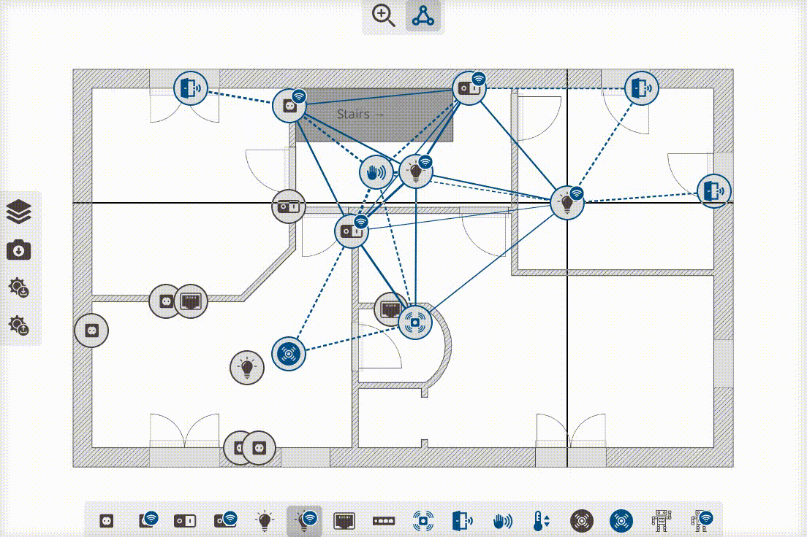

# IOT mesh / electrical planner


This tool allows you to create an electrical / IOT (Z-Wave / Zigbee / EnOcean ...) plan for your (future) home. Everything runs locally (localStorage), no data is uploaded anywhere.

This is still a very early version, see "limitations".
Currently it's best to use it on a desktop / laptop with a mouse and high resolution.



## How to install / use

```
$ git clone https://github.com/jonathan-reisdorf/iot-mesh-planner.git
$ npm install
$ npm start
```

then open your browser at http://localhost:10001

## Limitations

The following things are planned for the future (not yet available):

- Add actual plan dimensions, calculate signal strength based on actual dimensions rather than relatively
- Adjust signal strength (of individual nodes / overall)
- Magnetism / more precise adjustments
- Distinguish between different networks
- Warn about hourglass effect etc.
- Add toggle to show only shortest paths to hub
- Keyboard navigation, accessibility improvements
- Mobile device improvements
- Add more node types, simplify node palette
- Add note renderings to exported images
- Take into account walls / obstacles (difficult to add!)

## Contributions

Contributions (e.g. pull requests, ideas and issues) are very welcome!

## Credits

All icons are from The Noun Project (thenounproject.com, NounPro account).
